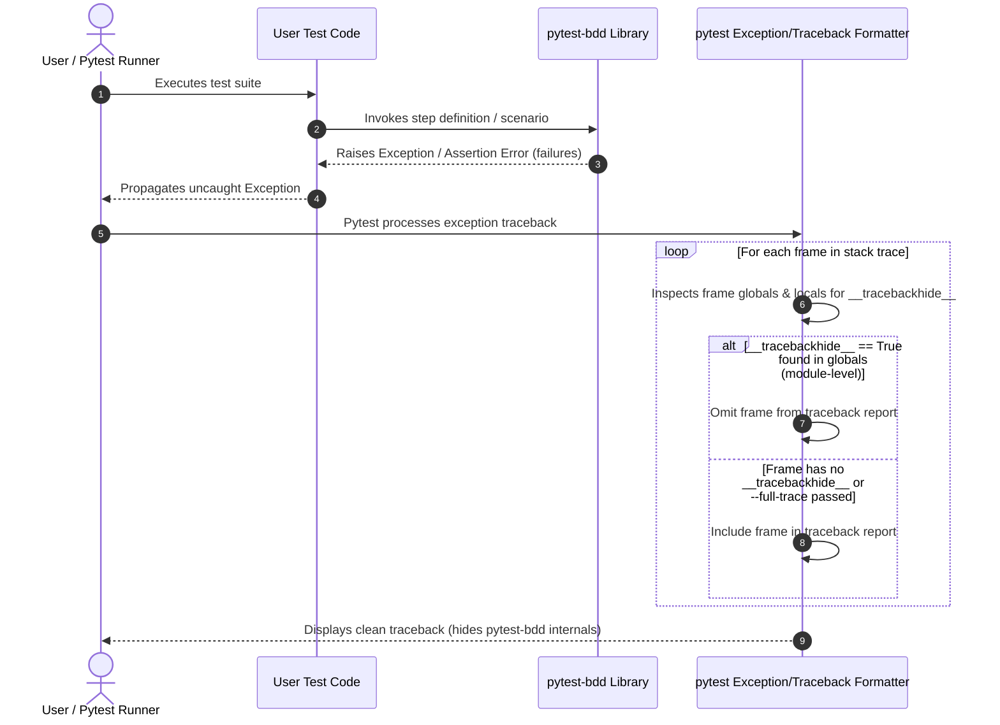

# Phase 31: Add __tracebackhide__ = True module-level to all src/pytest_bdd/ modules - Research

**Researched:** 2026-07-08
**Domain:** Pytest Traceback Hiding / Library Usability
**Confidence:** HIGH

## Summary

This phase focuses on adding `__tracebackhide__ = True` at the module level in all non-empty Python files under `src/pytest_bdd/`. This ensures that when user-written test cases fail, `pytest` will format the failure traceback by omitting internal library frames, resulting in clean, readable, and noise-free traceback reports. Redundant function-level `__tracebackhide__` variables in the library will be removed. Empty `__init__.py` files containing only `__all__ = []` are excluded.

**Primary recommendation:** Use a Python automation script using the `ast` module to locate correct insertion points below imports, write the module-level variable, and format the repository using `ruff format` to clean up spacing. Implement an integration test using the `testdir` fixture to assert traceback hiding behavior under standard and `--full-trace` modes.

<user_constraints>
## User Constraints (from CONTEXT.md)

### Locked Decisions
- **D-01:** Include all Python files and non-empty `__init__.py` files under `src/pytest_bdd/`, excluding empty `__init__.py` files that only contain `__all__ = []` and no code.
- **D-02:** Clean up existing redundant function-level `__tracebackhide__ = True` definitions (e.g. in `src/pytest_bdd/compatibility/pytest.py` and `src/pytest_bdd/plugin/pickle_runner/plugin/runner_plugin.py`) where module-level declarations are added.
- **D-03:** Do not add any explicit `__tracebackhide__ = False` overrides inside user-code invocation paths for now; let standard module-level hiding apply uniformly.
- **D-04:** Declare `__tracebackhide__ = True` at the module level, below all imports, and before any classes, functions, or other constants.
- **D-05:** Apply standard spacing: one blank line after imports, and two blank lines before any functions or classes.
- **D-06:** Write an integration test using the `testdir` fixture that runs a failing step and asserts that no `pytest_bdd` internal frames appear in the stdout traceback, but they DO appear when `--full-trace` is passed.
- **D-07:** Run the full test suite first, identify any traceback-checking tests that fail, and adjust them to either expect hidden frames or run with `--full-trace`.
- **D-08:** Use a robust Python script using regex/string operations to locate insertion points and insert the declaration after imports, followed by ruff formatting to clean up spacing.
- **D-09:** Store the automation script in the local scratch directory under the active phase (not committed to the repository).

### the agent's Discretion
- The planner/executor decides the exact implementation details of the regex-based Python script.
- The planner decides the exact location and name of the integration test file.

### Deferred Ideas (OUT OF SCOPE)
- None — discussion stayed within phase scope.
</user_constraints>

## Architectural Responsibility Map

| Capability | Primary Tier | Secondary Tier | Rationale |
|------------|-------------|----------------|-----------|
| Traceback Filtering | API / Backend | — | The Python interpreter / `pytest` runtime manages traceback construction and checks module-level globals for `__tracebackhide__` during formatting. |
| AST-based Code Insertion Script | Local Toolchain | — | Local Python script parsing AST nodes to insert declarations accurately before formatting. |
| Traceback Integration Test | Integration Testing | — | Uses the `testdir` fixture to run a subprocess test and inspect stdout traceback frames. |

## Standard Stack

### Core
| Library | Version | Purpose | Why Standard |
|---------|---------|---------|--------------|
| pytest | >= 7.0.0 | Test runner and traceback formatting engine [VERIFIED: pyproject.toml] | The framework under test; implements the `__tracebackhide__` feature. |
| Python stdlib `ast` | 3.10+ | AST parsing to identify imports and insert variables | Included in standard library, highly reliable, and syntax-aware. |
| ruff | 0.12+ | Code formatting and linting cleanup [VERIFIED: pyproject.toml] | Project standard formatter for spacing/PEP8 compliance. |

### Supporting
| Library | Version | Purpose | When to Use |
|---------|---------|---------|-------------|
| None | — | — | — |

### Alternatives Considered
| Instead of | Could Use | Tradeoff |
|------------|-----------|----------|
| `ast` module | Simple Regex | Regex has edge cases with multi-line imports, comments, and strings. AST is fully syntax-aware and robust. |

## Package Legitimacy Audit

No external packages are installed or upgraded in this phase [VERIFIED: requirements analysis].

| Package | Registry | Age | Downloads | Source Repo | Verdict | Disposition |
|---------|----------|-----|-----------|-------------|---------|-------------|
| None | — | — | — | — | — | Approved |

**Packages removed due to [SLOP] verdict:** none
**Packages flagged as suspicious [SUS]:** none

## Architecture Patterns

### System Architecture Diagram



### Recommended Project Structure
This phase modifies existing files and adds an integration test. No new folder structure is created.

```
src/
└── pytest_bdd_toolchain/
    └── case/
        └── integration/
            └── test_tracebackhide.py   # New integration test file [VERIFIED: D-06]
```

### Pattern 1: Module-Level tracebackhide Placement
**What:** Place `__tracebackhide__ = True` right after module-level imports, separated by standard spacing.
**When to use:** In all non-empty Python files.
**Example:**
```python
# Source: [CITED: docs.pytest.org/en/stable/how-to/writing_plugins.html]
from __future__ import annotations

import sys
from typing import Any

__tracebackhide__ = True


def helper():
    raise ValueError("Oops")
```

### Anti-Patterns to Avoid
- **Hardcoding line-number offsets:** Do not use hardcoded offsets when modifying files, as lines can shift. Use the AST module to dynamically locate the last import node.
- **Double definitions:** Do not add `__tracebackhide__ = True` to modules where it is already defined at the top level.

## Don't Hand-Roll

| Problem | Don't Build | Use Instead | Why |
|---------|-------------|-------------|-----|
| Formatting modified code | Custom line spacing logic | `ruff format` | Spacing conforms to PEP8 and avoids linter/formatter errors automatically. |

## Runtime State Inventory

| Category | Items Found | Action Required |
|----------|-------------|------------------|
| Stored data | None | None — verified by checking tracebackhide is in-memory only. |
| Live service config | None | None — verified by checking tracebackhide does not interact with external configs. |
| OS-registered state | None | None — verified by checking no OS-level registrations exist. |
| Secrets/env vars | None | None — verified by checking no secrets/env vars are modified. |
| Build artifacts | None | None — standard python source changes will compile normally. |

## Common Pitfalls

### Pitfall 1: Empty `__init__.py` files
**What goes wrong:** Adding `__tracebackhide__ = True` to empty `__init__.py` files triggers ruff/pylint warnings or changes package properties.
**Why it happens:** Package marker files (`__init__.py`) are sometimes left empty or only contain `__all__ = []` to mark exports.
**How to avoid:** Explicitly parse AST and check if a file only contains a docstring and/or an empty `__all__ = []`. If so, skip it.

### Pitfall 2: Broken debug output for library developers
**What goes wrong:** Library developers are unable to debug library internals if they cannot see the tracebacks.
**Why it happens:** Hiding tracebacks suppresses internal stack frames.
**How to avoid:** Ensure that running pytest with `--full-trace` bypasses the traceback hiding and shows all internal frames.

## Code Examples

### AST Insertion Script (to be stored in scratch directory)
```python
import ast
import pathlib

def insert_tracebackhide(file_path: pathlib.Path) -> bool:
    content = file_path.read_text(encoding="utf-8")

    # 1. Parse AST to analyze nodes
    try:
        tree = ast.parse(content)
    except SyntaxError:
        return False

    # 2. Exclude empty or __all__ = [] only __init__.py files
    if file_path.name == "__init__.py":
        has_real_code = False
        for node in tree.body:
            if isinstance(node, ast.Expr) and isinstance(node.value, ast.Constant) and isinstance(node.value.value, str):
                continue  # Skip docstrings
            if isinstance(node, ast.Assign):
                for target in node.targets:
                    if isinstance(target, ast.Name) and target.id == "__all__":
                        if isinstance(node.value, ast.List) and len(node.value.elts) == 0:
                            continue  # Skip empty __all__
            has_real_code = True
            break
        if not has_real_code:
            return False

    # 3. Check for existing __tracebackhide__
    for node in tree.body:
        if isinstance(node, ast.Assign):
            for target in node.targets:
                if isinstance(target, ast.Name) and target.id == "__tracebackhide__":
                    return False  # Already present

    # 4. Find the last import statement line number
    last_import_line = 0
    docstring_end_line = 0

    if tree.body and isinstance(tree.body[0], ast.Expr) and isinstance(tree.body[0].value, ast.Constant) and isinstance(tree.body[0].value.value, str):
        docstring_end_line = tree.body[0].end_lineno

    for node in tree.body:
        if isinstance(node, (ast.Import, ast.ImportFrom)):
            if node.end_lineno > last_import_line:
                last_import_line = node.end_lineno

    # 5. Insert variables after the last import line (or docstring/start of file)
    lines = content.splitlines(keepends=True)
    insert_idx = last_import_line if last_import_line > 0 else (docstring_end_line if docstring_end_line > 0 else 0)

    decl = "\n__tracebackhide__ = True\n"
    if insert_idx < len(lines):
        lines.insert(insert_idx, decl)
    else:
        lines.append(decl)

    file_path.write_text("".join(lines), encoding="utf-8")
    return True
```

## State of the Art

| Old Approach | Current Approach | When Changed | Impact |
|--------------|------------------|--------------|--------|
| Function-level `__tracebackhide__ = True` inside helpers | Module-level `__tracebackhide__ = True` at top of file | pytest 2.x | Uniformly hides all helper/internal functions defined in that module, eliminating boilerplate. |

## Assumptions Log

| # | Claim | Section | Risk if Wrong |
|---|-------|---------|---------------|
| A1 | No tests inside `src/pytest_bdd_toolchain/case` explicitly assert the exact stack trace contents (except testing failure reasons) and will fail if frames are removed. | Verification Strategy | Existing tests might fail if they verify full tracebacks without `--full-trace`. Risk: Low (our grep didn't find any references). |

## Validation Architecture

### Test Framework
| Property | Value |
|----------|-------|
| Framework | pytest 9.1.1 [VERIFIED: pytest runtime status] |
| Config file | pyproject.toml |
| Quick run command | `uv run pytest src/pytest_bdd_toolchain/case/unit/test_utils.py` |
| Full suite command | `uv run pytest src/pytest_bdd_toolchain/case/unit -n auto` |

### Phase Requirements → Test Map
| Req ID | Behavior | Test Type | Automated Command | File Exists? |
|--------|----------|-----------|-------------------|-------------|
| REQ-01 | Internal frames of pytest-bdd do not appear in tracebacks by default but appear when `--full-trace` is passed. | integration | `uv run pytest src/pytest_bdd_toolchain/case/integration/test_tracebackhide.py` | ❌ Wave 0 |

### Sampling Rate
- **Per task commit:** `uv run pytest src/pytest_bdd_toolchain/case/unit/test_utils.py`
- **Per wave merge:** `uv run pytest src/pytest_bdd_toolchain/case/unit -n auto`
- **Phase gate:** Full suite green before `/gsd-verify-work`

### Wave 0 Gaps
- [ ] `src/pytest_bdd_toolchain/case/integration/test_tracebackhide.py` — integration test to verify frame hiding.

## Security Domain

### Applicable ASVS Categories

| ASVS Category | Applies | Standard Control |
|---------------|---------|-----------------|
| V2 Authentication | no | — |
| V3 Session Management | no | — |
| V4 Access Control | no | — |
| V5 Input Validation | yes | Gherkin parsing validation (unchanged in this phase) |
| V6 Cryptography | no | — |

### Known Threat Patterns for pytest-bdd-ng

| Pattern | STRIDE | Standard Mitigation |
|---------|--------|---------------------|
| Information Disclosure | Information Disclosure | Tracebacks hidden by default, can be re-enabled via `--full-trace` for developers. |

## Sources

### Primary (HIGH confidence)
- `pytest` official docs — [tracebackhide documentation](https://docs.pytest.org/en/stable/how-to/writing_plugins.html#writing-assertion-helpers)
- Python standard library AST documentation — [ast module reference](https://docs.python.org/3/library/ast.html)

### Secondary (MEDIUM confidence)
- WebSearch verified with official source — `__tracebackhide__` module level variable support in pytest.

## Metadata

**Confidence breakdown:**
- Standard stack: HIGH - Core pytest feature and standard python library elements.
- Architecture: HIGH - Integration is purely in-process Python/pytest.
- Pitfalls: HIGH - Empty `__init__.py` files and redundant function-level overrides are well-defined.

**Research date:** 2026-07-08
**Valid until:** 2026-08-07
