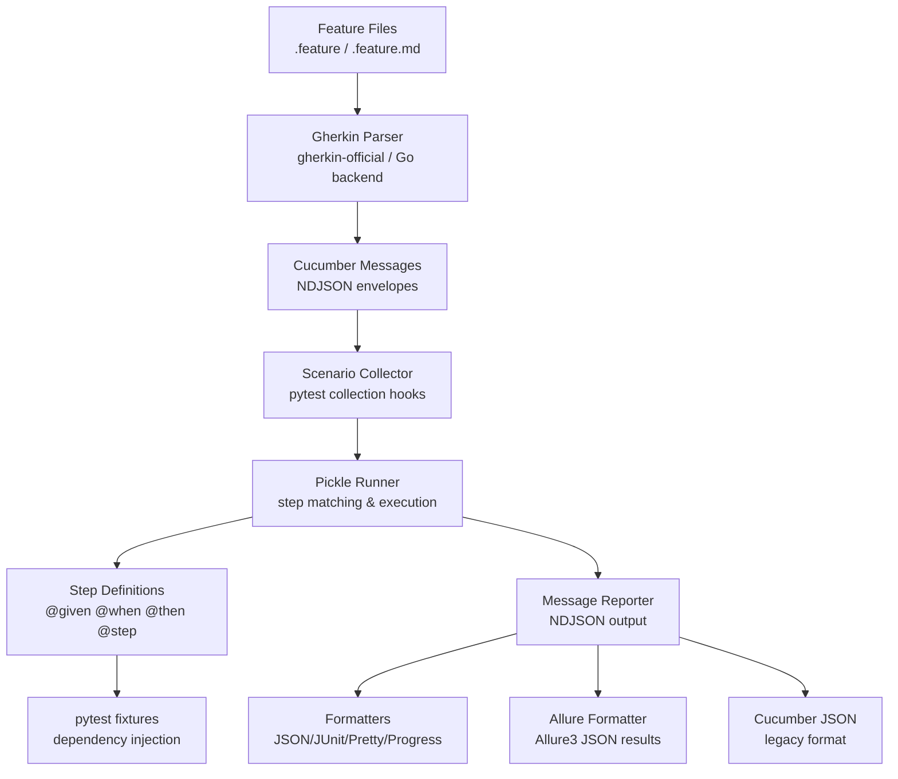

<!-- generated-by: gsd-doc-writer -->
# Architecture

## System Overview

pytest-bdd-ng is a BDD testing plugin for pytest that bridges Cucumber's Gherkin specification language with Python's pytest infrastructure. It parses Gherkin feature files (both plain and Markdown formats), collects scenarios as pytest tests, matches step definitions, executes them within pytest's fixture system, and produces Cucumber-compatible reports via the messages protocol.

The architecture follows a layered plugin design: a core runtime handles Gherkin parsing and scenario execution, while 18+ optional plugins provide formatters, reporters, and specialized integrations (Allure, code generation, StructBDD). All components integrate through pytest's hook system.

## Component Diagram



## Data Flow

1. **Collection phase**: pytest discovers `*.feature` / `*.feature.md` files via `scenario_test_collector` plugin. Each file is parsed by the Gherkin parser into Cucumber Message envelopes (feature, scenario, pickle, step definitions).

2. **Scenario binding**: Pickle messages are converted into pytest test functions via `scenario()` or `scenarios()` API calls. Each pickle becomes a parametrized test case.

3. **Execution phase**: `pickle_runner` executes each scenario's steps sequentially. Steps are matched against `@given`/`@when`/`@then`/`@step` decorated functions using both Cucumber expressions and regular expressions.

4. **Fixture injection**: Step definitions receive pytest fixtures via dependency injection. Step parameters (from DataTables, DocStrings, custom parsers) are injected as function arguments.

5. **Reporting**: During execution, `gherkin_message_reporter` captures all Cucumber messages. Post-execution, formatter plugins (JSON, JUnit, Pretty, Allure, etc.) consume these messages to produce output.

## Key Abstractions

| Abstraction | Location | Purpose |
|---|---|---|
| `scenario()` / `scenarios()` | `src/pytest_bdd/scenario.py` | Public API for binding Gherkin scenarios to test functions |
| `GherkinParser` | `src/pytest_bdd/parser.py` | Parses .feature and .feature.md files into Cucumber messages |
| `MarkdownGherkinParser` | `src/pytest_bdd/parser.py` | Markdown-wrapped Gherkin dialect parser |
| `FeatureFileModule` | `src/pytest_bdd/collector.py` | pytest collector for feature files |
| `FeatureBatchParser` | `src/pytest_bdd/collector_batch.py` | Batch parsing for large feature sets |
| `Run` / `ScenarioRun` | `src/pytest_bdd/model/scenario_run.py` | Runtime execution state model |
| `StepDefinition` | `src/pytest_bdd/steps.py` | Step matching and definition management |
| `FileScenarioLocator` | `src/pytest_bdd/scenario_locator.py` | Resolves feature file paths |
| `MessageConverter` | `src/pytest_bdd/model/message_converter.py` | Dict <-> cucumber_messages conversion |

## Directory Structure

```
src/pytest_bdd/
├── __init__.py              # Public API: scenario, scenarios, given, when, then, step
├── scenario.py              # scenario() and scenarios() implementation
├── parser.py                # Gherkin/Markdown Gherkin parsers
├── collector.py             # Feature file pytest collector
├── collector_batch.py       # Batch collection for performance
├── steps.py                 # Step definition manager and matchers
├── scenario_locator.py      # File/URL scenario resolution
├── model/                   # Runtime data models
│   ├── scenario_run.py      # Run, ScenarioRun, FeatureRuntimeBinding
│   ├── stash_access.py      # pytest.config.stash abstraction
│   └── message_converter.py # Cucumber message conversion
├── plugin/                  # 18+ pytest plugins
│   ├── allure_formatter/     # Allure report integration
│   ├── pickle_runner/       # Scenario execution runtime
│   ├── scenario_test_collector/ # Feature autoload
│   ├── gherkin_message_reporter/ # Live message output
│   ├── cucumber_json/       # Cucumber JSON reporter
│   ├── cucumber_junit/      # JUnit XML reporter
│   ├── cucumber_pretty/     # Pretty formatter
│   ├── cucumber_progress/   # Progress bar formatter
│   ├── struct_bdd/          # YAML/JSON/HOCON/TOML BDD
│   ├── code_generator/      # Step definition code gen
│   └── ...                  # Additional formatters
├── steps/                   # Step definition utilities
├── testing/                 # Test helpers (CCK, Docker)
├── types/                   # Type definitions
├── util/                    # Utilities (test group ordering)
├── compatibility/           # Python/pytest version matrix
├── template/                # Jinja2 templates
└── _gherkin_go/             # Go-based Gherkin parser backend
```

## Plugin Architecture

All 18 plugins register via `pytest11` entry points in `pyproject.toml`. Each plugin:
1. Declares a `pytest11` entry point (e.g., `pytest-bdd-cucumber-json = pytest_bdd.plugin.cucumber_json.entrypoint`)
2. Implements a `pytest_plugins` module with hook implementations
3. Can be disabled via `pytest -p no:plugin-name`

Key plugin groups:
- **Core**: `scenario_test_collector`, `pickle_runner`, `gherkin_message_reporter`
- **Formatters**: `cucumber_json`, `cucumber_junit`, `cucumber_pretty`, `cucumber_progress`, `cucumber_summary`, `cucumber_usage`
- **Reporting**: `allure_formatter`, `gherkin_terminal_reporter`, `scenario_reporter`
- **Extensions**: `code_generator`, `struct_bdd`
