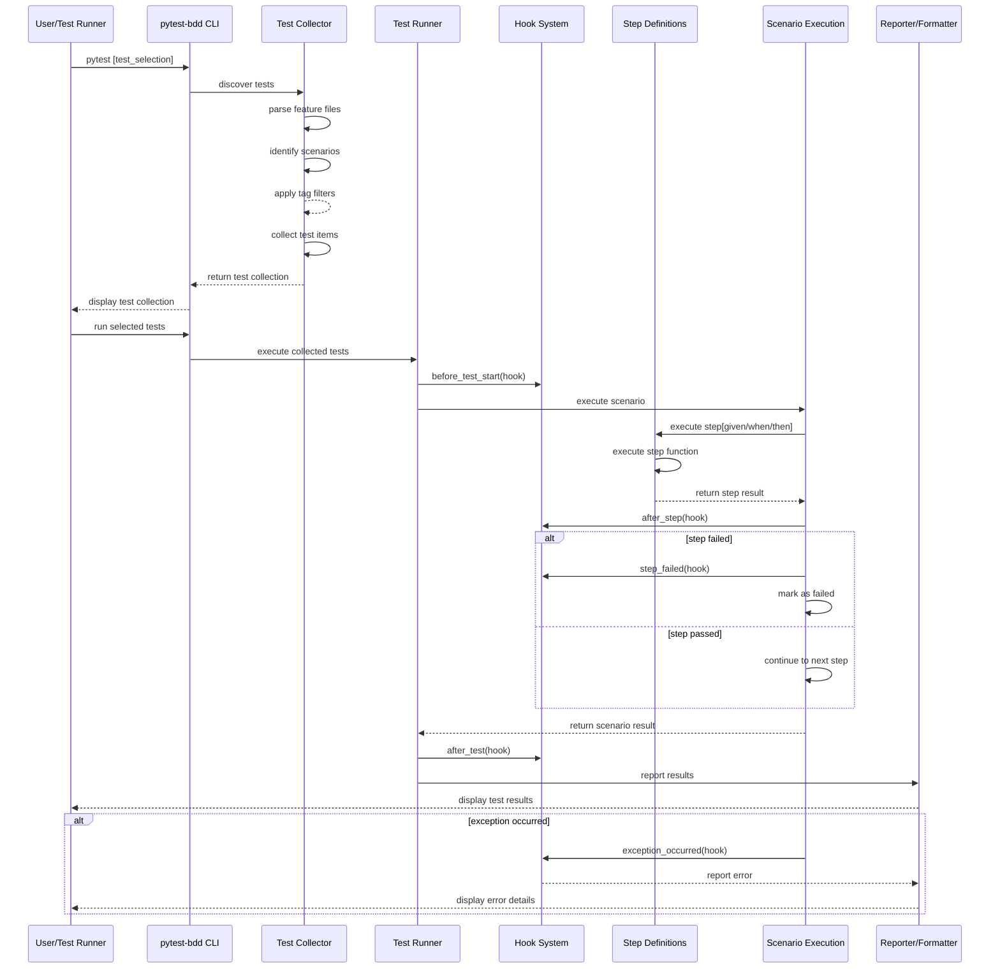

# Data Flow Architecture

## Overview

This document illustrates the primary data flows and execution paths in the pytest-bdd system, showing how information moves through the various components during test execution.

## Execution Flow Diagram

## Explanation

### Test Discovery Flow
The process begins when a user runs pytest with test selection arguments. The pytest-bdd CLI interface handles the initial command parsing and delegates test discovery to the Collector component.

1. **Feature File Parsing**: The Parser reads `.feature` files and converts them into AST representations
2. **Scenario Identification**: The Collector walks through the AST to identify individual scenarios
3. **Tag Filtering**: Scenarios are filtered based on tag expressions provided via command line or configuration
4. **Test Collection**: Valid scenarios are converted into test items that pytest can execute

### Test Execution Flow
Once tests are collected, execution proceeds through a well-defined sequence:

1. **Lifecycle Hooks**: Before test execution begins, pytest-bdd invokes registered `before_test_start` hooks
2. **Scenario Execution**: Each scenario is executed sequentially, with step-by-step processing:
   - Step Definition Lookup: Matching step text to registered step definitions
   - Step Execution: Invoking the associated Python function
   - Result Processing: Capturing return values or exceptions
   - Step Hooks: Invoking `after_step` and potentially `step_failed` hooks
3. **Scenario Completion**: After all steps complete, the scenario result is returned to the runner
4. **Reporting**: Results are passed to registered reporters/formatters for output generation
5. **Cleanup**: Final `after_test` hooks are invoked for cleanup activities

### Error Handling
Throughout execution, pytest-bdd provides comprehensive error handling through its hook system:
- Exceptions during step execution are caught and routed through the `exception_occurred` hook
- Reporters can customize how errors are displayed to users
- Failed scenarios continue to execute remaining hooks before moving to the next test

## Key Data Elements

Throughout the flow, several key data elements are passed between components:

- **Feature AST**: Parsed representation of `.feature` files
- **Scenario Objects**: Contain steps, tags, metadata, and execution state
- **Step Match Results**: Information about which step definition matches a given step
- **Execution Results**: Return values, exceptions, and timing information from step execution
- **Hook Context**: Shared data accessible to hooks during execution

## Relationships

This data flow diagram complements the project structure documentation by showing how the components identified in the structure diagram interact during actual test execution. It particularly highlights:
- The sequential nature of scenario execution
- The extensibility provided by the hook system
- The separation between test discovery and test execution phases
- The role of reporters in customizing output formats
