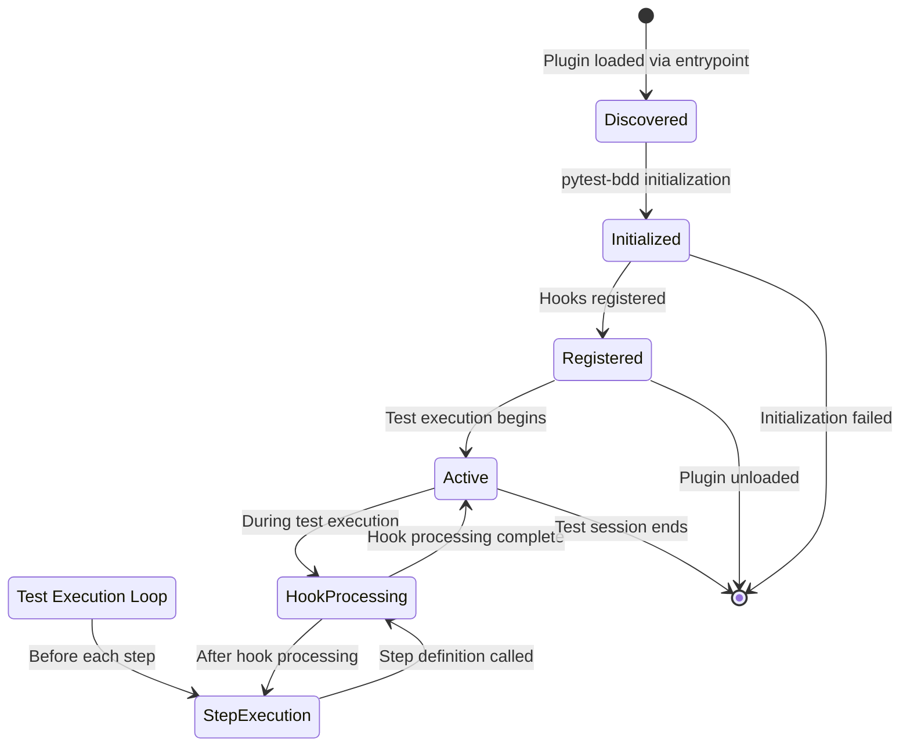
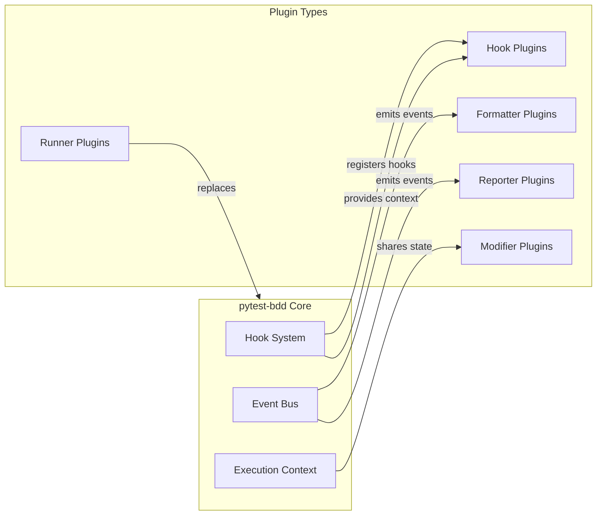

# Plugin Architecture

## Overview

This document describes pytest-bdd's plugin architecture, showing how the system is designed to be extended through various plugin mechanisms and extension points.

## Plugin Lifecycle Diagram

## Plugin Interface Diagram

## Explanation

### Plugin Discovery and Loading
pytest-bdd uses Python's entrypoint system for plugin discovery:

1. **Entrypoint Definition**: Plugins define entrypoints in their `pyproject.toml` or `setup.py` under the `pytest11` group
2. **Discovery**: During initialization, pytest-bdd discovers all plugins registered under the `pytest11` entrypoint group
3. **Loading**: Discovered plugins are imported and instantiated
4. **Initialization**: Each plugin receives a reference to the pytest-bdd hook system for registration

### Plugin Types and Extension Points
pytest-bdd supports several types of plugins, each serving different extension purposes:

#### Hook Plugins
The most common type, hook plugins extend or modify pytest-bdd behavior by
registering hook implementations:
- **Lifecycle Hooks**: `before_test_start`, `after_test`, `before_step`, `after_step`
- **Result Hooks**: `step_failed`, `exception_occurred`
- **Collection Hooks**: `modify_test_collection`, `filter_test_items`

#### Formatter Plugins
These plugins format test results for display:
- Receive events from the event bus
- Transform raw execution data into human-readable output
- Examples: pretty formatter, progress bar, JSON formatter

#### Reporter Plugins
Reporter plugins handle test result reporting:
- Similar to formatters but often integrate with external systems
- Examples: Allure integration, custom reporting systems

#### Runner Plugins
Runner plugins replace or augment the test execution mechanism:
- Can completely change how tests are executed
- Examples: distributed testing, subprocess isolation

#### Modifier Plugins
Modifier plugins alter core behavior or data:
- Can modify test parameters before execution
- Can alter step definition resolution
- Can change how features are parsed

### Hook System Architecture
The hook system provides the primary extension mechanism:

1. **Event Registration**: Plugins register functions to specific hook names
2. **Hook Execution**: During test execution, the system calls all registered hooks for a given event
3. **Context Sharing**: Hooks receive execution context allowing them to inspect and modify state
4. **Ordering**: Plugins can specify hook execution order using `tryfirst`/`trylast` modifiers
5. **Result Modification**: Hooks can modify return values or raise exceptions to alter execution flow

### Plugin Communication
Plugins can interact through several mechanisms:

- **Shared Context**: Access to execution state via the hook system
- **Event Bus**: Publish/subscribe mechanism for loose coupling
- **Direct Calls**: Plugins can call each other's public APIs (less common)
- **Configuration Sharing**: Access to shared configuration objects

## Relationships

This plugin architecture diagram complements both the project structure and data flow diagrams:

- **With Project Structure**: Shows how plugins integrate with and extend the core components identified in the structure diagram
- **With Data Flow**: Illustrates where plugin interception points occur in the execution sequence
- **Extension Points**: Highlights specific locations where plugins can modify behavior:
  - Test discovery and collection
  - Before/after test execution
  - Before/after each step execution
  - Error and exception handling
  - Result reporting and formatting

## Best Practices for Plugin Development

1. **Focused Responsibility**: Each plugin should have a clear, single purpose
2. **Backward Compatibility**: Avoid breaking changes to hook signatures
3. **Performance Considerations**: Minimize work in frequently-called hooks (like `before_step`)
4. **Error Handling**: Plugins should handle their own errors to avoid breaking test execution
5. **Documentation**: Clear documentation of what extension points are used and what they modify
6. **Naming Conventions**: Use descriptive names that indicate the plugin's purpose
