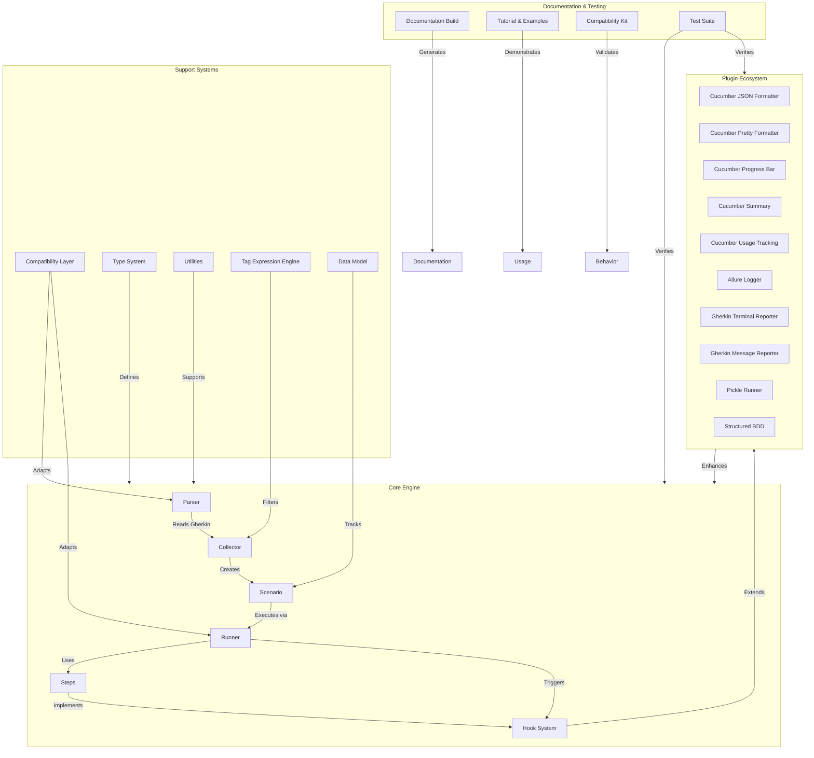

# Project Structure

## Overview

This document describes the high-level architectural structure of the pytest-bdd project, showing the major components and their relationships.

## Component Diagram

## Explanation

### Core Engine
The core engine consists of components responsible for parsing Gherkin scenarios, collecting test cases, executing scenarios, and managing step definitions:

- **Parser**: Converts Gherkin source files into structured AST (Abstract Syntax Tree) representations
- **Collector**: Discovers and organizes scenarios and features into executable test items
- **Runner**: Executes collected test items and manages execution lifecycle
- **Scenario**: Represents individual scenarios with their steps, tags, and metadata
- **Steps**: Manages step definitions and their bindings to scenario steps
- **Hook System**: Provides extension points for modifying test execution behavior

### Plugin Ecosystem
pytest-bdd features a rich plugin ecosystem that extends functionality without modifying core code:

- **Formatters**: Various output formatters (JSON, Pretty, Progress, Summary, Usage)
- **Loggers**: Specialized loggers like Allure for test reporting integration
- **Reporters**: Terminal and message-based reporters for different output formats
- **Runners**: Alternative execution strategies like pickle-based distributed testing
- **Structured BDD**: Enhanced modeling capabilities for complex scenarios

### Supporting Systems
These systems provide foundational services used throughout the codebase:

- **Compatibility Layer**: Ensures compatibility with different pytest and Gherkin versions
- **Type System**: Defines core data types and protocols used throughout
- **Utilities**: Common helper functions and shared functionality
- **Tag Expression Engine**: Evaluates tag expressions for test filtering
- **Data Model**: Internal representation of execution state and results

### Documentation & Testing
Components focused on project quality and usability:

- **Documentation Build**: Generates project documentation using Sphinx
- **Tutorial & Examples**: Provides learning materials and usage examples
- **Compatibility Kit**: Validates behavior across different implementations
- **Test Suite**: Comprehensive test coverage for the project itself

## Relationships

- The **Core Engine** depends on the **Support Systems** for foundational capabilities
- The **Plugin Ecosystem** extends and enhances the **Core Engine** functionality
- **Documentation & Testing** components consume and validate all other systems
- Data flows from **Parser** → **Collector** → **Runner** → **Steps/Hooks** during test execution
